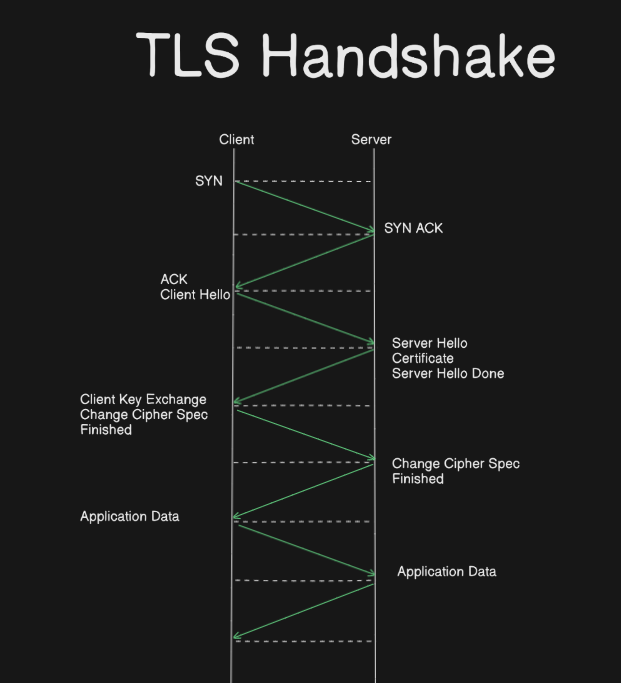

# Quantum Safe TLS

TLS is a data privacy and security protocol implemented for secure communication over internet. It usually encrypts communication between server and clients. TLS is a successor to Secure Socket Layer (SSL) protocol. SSL v3.0 and TLS v1.0 were very similar but it was replaced with TLS. You can also refer to Transport Layer Security (TLS). A Transport Layer Security (TLS) connection is established via handshake. 

## TLS Handshake in action :

